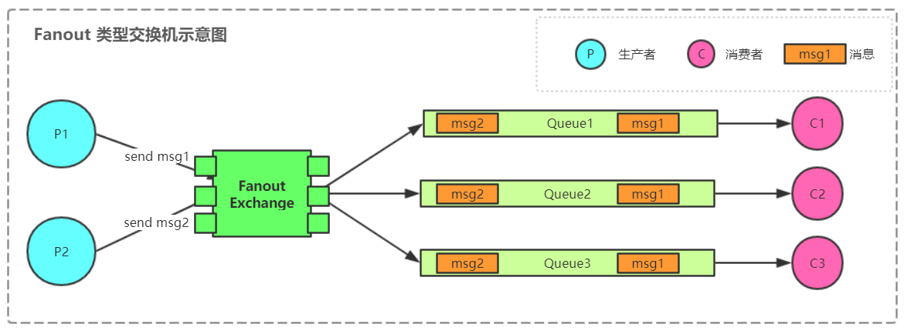

[TOC]

# Broker 整体架构


通过上面的图可以看到里面有几个概念
* Producer：消息生产者，就是投递消息的程序。
 
* Consumer：消息消费者，就是接受消息的程序。

* Broker：即消息队列服务器实体

* Exchange：消息交换机，根据生产者的routingKey 和 消费者的routingKey 进行匹配。

* Queue：消息队列载体，每个消息都会被投入到一个或多个队列。
 
* Binding：绑定，它的作用就是把exchange和queue按照路由规则绑定起来。

* RoutingKey：路由关键字，exchange根据这个关键字进行消息投递。
 
* Channel：消息通道，在客户端的每个连接里，可建立多个channel，每个channel代表一个会话任务。

## Exchange 的几种转发方式

### Fanout 

> `Fanout`所有发送到该`Exchange`的消息转发至所有绑定的`Queue`上。



上图所示，`生产者P1`将`msg1`推送到`Fanout Exchange`，`生产者P2`将`msg2`推送到`Fanout Exchange`，
由于后面的三个消费者C1、C2、C3于这个Exchanger进行的绑定，所以都会接收到这两个消息。

### Direct

> direct类型和上面的一种路由方式完全不同，direct就是直接的意思，通过这个字面意思，只有**消费者**配置的`RoutingKey`和**生产者**发送消息的时候设置的`RoutingKey`**完全一致**，才会进行转发消息。


1. 当`生产者P1`发送`RoutingKey`为`c1`的消息`c1_msg1`时，这时候将消息发送给`Direct Exchange`，
2. `Direct Exchange`根据`c1`找对应得队列`Queue1`，这时候消息会发送给消费者`C1`。
3. 同理，`生产者P2`发送的`c2_msg`会经过`Direct Exchange`发送给消费者`C2`
#### 代码示例

consumer
```java
channel.queueDeclare(QUEUE_NAME, false, false, false, null);
        
        Consumer consumer = new DefaultConsumer(channel) {
            @Override
            public void handleDelivery(String consumerTag, Envelope envelope, AMQP.BasicProperties properties, byte[] body)
                    throws IOException {
                String msg = new String(body, "UTF-8");
                System.out.println("Received is = '" + msg + "'");
            }
        };

        channel.queueBind(QUEUE_NAME, DIRECT_EXCHANGE_NAME, "hello");
        channel.basicConsume(QUEUE_NAME, true, consumer);

```
producer
```java
     Channel channel = ChannelFactory.getChannelInstance();

    channel.exchangeDeclare(DIRECT_EXCHANGE_NAME, "direct");

    String msg = "hello rabbitmq! ---- ";
    channel.basicPublish(DIRECT_EXCHANGE_NAME, "hello", null, msg.getBytes());


    channel.close();
    channel.getConnection().close();
```

[点击查看](https://github.com/wuhulala/mq-collection/tree/master/rabbitmq/rabbitmq-chapter1-simple/src/main/java/com/wuhulala/rabbitmq/chapter1/exchange/direct)

### Topic 
> topic和上面的direct 有些区别，我这里把它理解为direct的超集，它可以在消费者端配置一个类似于正则表达式的东西，`Exchange`可以根据生产者的`RoutingKey`和消费者的规则进行一个正则匹配,匹配成功则转发消息到消费者上。，通过通配符来实现。

它的约定是：
- `RoutingKey`可以是一个句点号`.`分隔的字符串，如`a.b.c`、`news.shanghai`、`news.hangzhou`
- 消费者端的`RoutingKey`中可以存在两种特殊字符`*`与`#`，用于做模糊匹配，其中`*`用于匹配一个单词，`#`用于匹配n（>=0）个单词


当生产者发送消息时，假设有以下几种情况

1. 当`生产者P1`发送`RoutingKey`为`A.B.C`的消息`msg_A.B.C`时，这时候`Direct Exchange`会将消息转发给`C1`,`C2`,`C3`，

2. 当`生产者P2`发送`RoutingKey`为`B.C`的消息`msg_A.B.C`时，这时候`Direct Exchange`只会将消息转发给,`C3`，

#### 代码示例

定义以上图的标准
```
public interface Constants {

    String TOPIC_EXCHANGE_NAME = "topic-exchange";
    String P_ROUTING_KEY_1 = "A.B.C";
    String P_ROUTING_KEY_2 = "B.C";
    String C_ROUTING_KEY_1 = "A.B.*";
    String C_ROUTING_KEY_2 = "*.B.#";
    String C_ROUTING_KEY_3 = "#.B.C";

}
```
代码位置
[点击查看](https://github.com/wuhulala/mq-collection/tree/master/rabbitmq/rabbitmq-chapter1-simple/src/main/java/com/wuhulala/rabbitmq/chapter1/exchange/topic)
### header

> headers 类型的交换器不依赖于路由键的匹配规则来路由消息，而是根据发送的消息内容中的 headers 属性进行匹配。在绑定队列和交换器时制定一组键值对， 当发送消息到交换器时， RabbitMQ 会获取到该消息的 headers (也是一个键值对的形式)，对比其中的键值对是否完全匹配队列和交换器绑定时指定的键值对，如果完全匹配则消息会路由到该队列，否则不会路由到该队列。 headers 类型的交换器性能会很差，而且也不实用，基本上不会看到它的存在。


1. 当`生产者P1`发送消息`msg`时，只有消费者`C1`这时候和他的请求头匹配，所以`Header Exchange`只会将消息转发给`C1`。

#### 代码测试

Producer.java
```java
   AMQP.BasicProperties props = new AMQP.BasicProperties().builder()
           .headers(ImmutableMap.<String, Object>of("a", "A", "b", "B")).build();

   String msg = "msg";
   System.out.println("Producer1 send ::: " + msg);
   channel.basicPublish(Constants.HEADER_EXCHANGE_NAME, P_ROUTING_KEY_1, props, msg.getBytes());
```

Consumer.java
```java
  channel.queueBind(QUEUE_NAME, HEADER_EXCHANGE_NAME, "", ImmutableMap.<String, Object>of("a", "A", "b", "B"));

```
[点击查看](https://github.com/wuhulala/mq-collection/tree/master/rabbitmq/rabbitmq-chapter1-simple/src/main/java/com/wuhulala/rabbitmq/chapter1/exchange/header)
