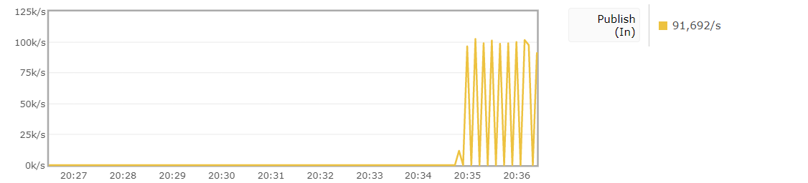
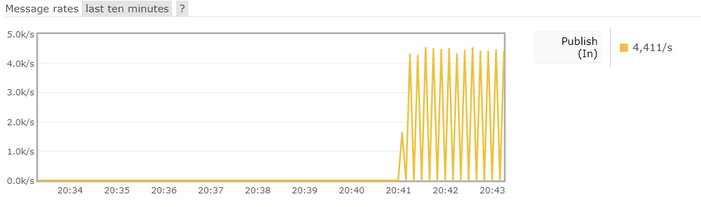
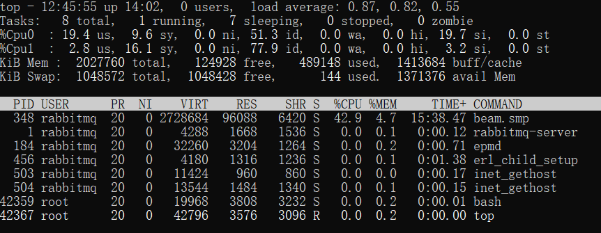
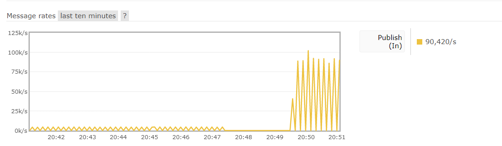
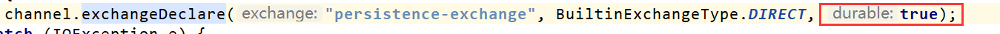
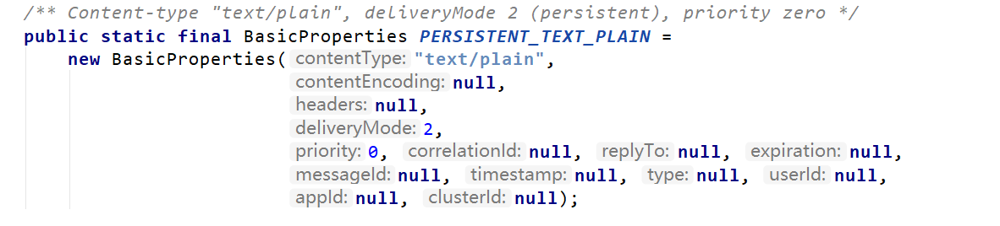
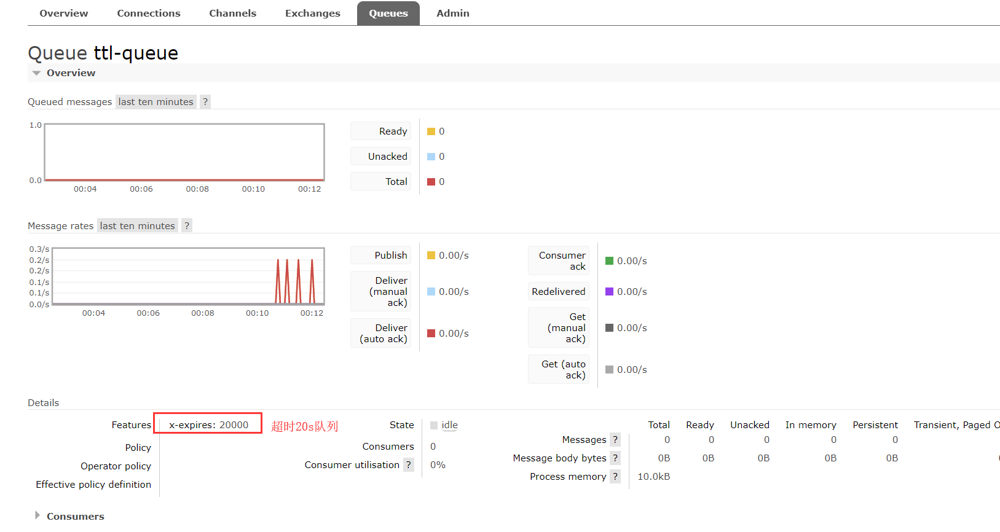
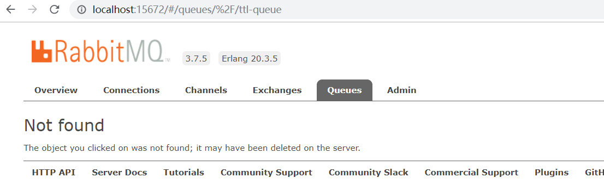
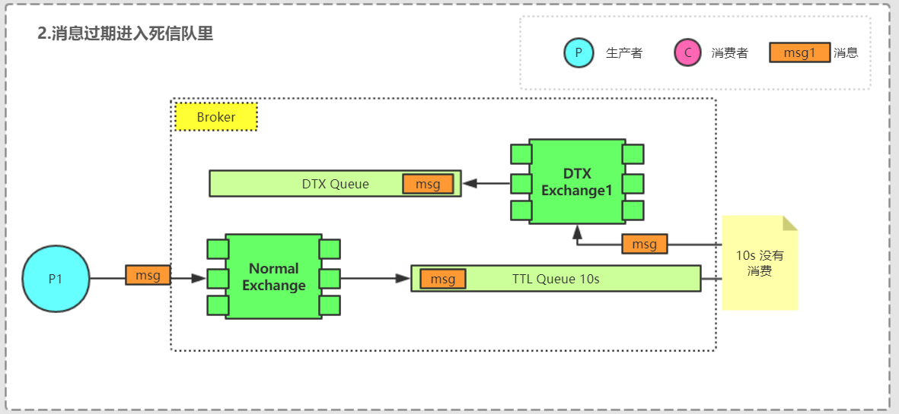
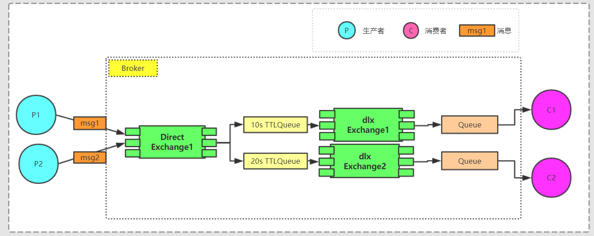

[TOC]

# RabbitMQ 高级特性

## 消息可靠性投递（可靠性发送）

> 当消息的生产者将消息发送出去之后，消息 到底有没有正确地到达服务器呢?如果不进行特殊配置，默认情况下发送消息的操作是不会返回任何信息给生产者的，也就是默认情况下生产者是不知道消息有没有正确地到达服务器。如果在消息到达服务器之前己经丢失，持久化操作也解决不了这个问题，因为消息根本没有到达服务器，何谈持久化?

针对以上的问题，RabbitMQ提供了以下的两种解决方案：
- 通过事务机制实现:
- 通过发送方确认 (publisher confirm) 机制实现

### 事务机制
RabbitMQ 客户端中与事务机制相关的方法有三个: 
1. channel.txSelect 开启事务
2. channel.txCommit 提交事务
3. channel.txRollback 事务回滚

和JDBC的事务三个步骤类似，都是三步走


#### 代码实现
```java
public static void main(String[] args) {
        Channel channel = ChannelFactory.getChannelInstance();

        logger.info("开启通道成功");
        try {
            channel.exchangeDeclare("tx-exchange", "direct");

            channel.txSelect();
            channel.basicPublish("tx-exchange", "tx", MessageProperties.PERSISTENT_BASIC, "hello tx".getBytes());
            int i = 1 / 0;
            channel.txCommit();
            logger.info("消息发送成功！");
        } catch (Exception e) {
            logger.error("消息发送失败", e);
            try {
                channel.txRollback();
            } catch (IOException e1) {
                logger.error("消息回滚失败", e1);
            }
        }
        ChannelFactory.closeChannel(channel);
        logger.info("关闭通道成功");

    }
```
事务确实能够解决消息发送方和 RabbitMQ 之间消息确认的问题，'只有消息成功被 RabbitMQ 接收，事务才能提交成功，
否则便可在捕获异常之后进行事务回滚，与此同时可以使用**消息重发机制**来保证消息不丢失。

除了这种方案保证消息发送的可靠性，还有其它什么方案呢？

从 AMQP 协议层面来看并没有更好的办法，但是 RabbitMQ 提供了一个改进方案，即发送方确认机制，详情请看下一节的介绍。

### 发送方确认机制

生产者将信道设置成 confmn C确认)模式，一旦信道进入 confmn 模式，所有在该信道上面发布的消息都会被指派一个唯一的 IDC从 l 开始)，
一旦消息被投递到所有匹配的队列之后， RabbitMQ 就会发送一个确认 CBasic.Ack) 给生产者(包含消息的唯一 ID)，这就使得生产者知晓消息已经正确到达了目的地了。
如果消息和队列是可持久化的，那么确认消息会在消息写入磁盘之后发出。 
RabbitMQ 回传给生产者的确认消息中的 deliveryTag 包含了确认消息的序号，此外 RabbitMQ 也可以设置 channel.basicAck 方法中的 multiple 参数，表示到 这个序号之前的所有消息都己经得到了处理
候的确认之间的异同。

#### 为什么比事务性能好
事务机制在一条消息发送之后会使发送端**阻塞**，以等待 RabbitMQ 的回应，之后才能继续发送下一条消息。

相比之下， 发送方确认机制最大的好处在于它是**异步**的，一旦发布一条消息，生产者应用程序就可以在**等信道返回确认的同时**继续发送下一条消息，当消息最终得到确认后，生产者应用程序便可以通过回调方法来处理该确认消息，
如果 RabbitMQ 因为自身内部错误导致消息丢失，就会发送一条 nack（Basic.Nack, not ack) 命令，生产者应用程序同样可以在回调方法中处理该 nack 命令。
生产者通过调用 channel.confirmSelect 方法(即 Confirm.Select 命令)将信道设置为 confirm 模式，
之后 RabbitMQ 会返回 Confirm.Select-Ok 命令表示同意生产者将当前信道设置为 confirm 模式。
所有被发送的后续消息都被 ack 或者 nack 一次，不会出现一条消息既被ack又被nack的情况，并且 RabbitMQ 也并没有对消息被 confirm 的快慢做任何保证。


#### 示例代码
```
public static void main(String[] args) {
        Channel channel = ChannelFactory.getChannelInstance();

        logger.info("开启通道成功");
        try {
            channel.exchangeDeclare("confirm-exchange", "direct");
            // 开启Confirm模式
            AMQP.Confirm.SelectOk ok = channel.confirmSelect();

            channel.basicPublish("confirm-exchange", "confirm", MessageProperties.PERSISTENT_BASIC, "hello tx".getBytes());
            logger.info("消息发送成功！");
        } catch (Exception e) {
            logger.error("消息发送失败", e);
        }
        // 6. 设置监听
        channel.addConfirmListener(new ConfirmListener() {
            public void handleAck(long deliveryTag, boolean multiple) throws IOException {
                System.out.println("-------服务端 ACK Success--------");
            }

            public void handleNack(long deliveryTag, boolean multiple) throws IOException {
                System.err.println("-------服务端 ACK Failed--------");
            }
        });

    }
```

#### 测试一下QPS

服务器环境 部署在windows（i78700 6C 3.2GHZ 16G）上的一个docker容器上面，运行时发现CPU飙到4.3GHZ，利用率30% ，因为分配给整个docker了2C。2/8 = 25%


1. Confirm 机制



2. 事务机制



docker 容器内部负载




可以看到上面，事务机制的时候的qps，会有二十倍性能的下降，这是为什么呢，我猜因为不是批量提交。


测试一下100条批量提交



基本和confirm持平。但是由于confirm机制是异步机制，也就是代码在顺序上正常执行，如果需要确认消息正常发送到broker，使用的是callback机制。和future类似。所以在现实编码中，使用这两种的哪一个，可以对照future的机制。


**QPS略微下降的原理**
> 对于持久化的消息来说，两者都需要等待消息确认落盘之后才会返回(调用 Linux内核的fsync方法)。在同步等待的方式下， publisher confirm 机制发送一条消息需要通 信交互的命令是 2 条:Basic.Publish 和 Basic .Ack; 事务机制是 3 条 :Basic.Publish、
Tx.Commmit/.Commit-Ok (或者 Tx.Rollback/.Rollback-Ok) ， 事务机制多了一个命令帧报文的交互，所以 QPS 会略微下降。

### 持久化存储
常见的持久化就是数据库。那么在这里面，可以做持久化的大致有以下几个地方:

1. exchange的持久化

   是通过在声明`Exchange`是将` durable `参数置为 `true` 实现的。

   ```java
    /**
        * Actively declare a non-autodelete exchange with no extra arguments
        * @see com.rabbitmq.client.AMQP.Exchange.Declare
        * @see com.rabbitmq.client.AMQP.Exchange.DeclareOk
        * @param exchange the name of the exchange
        * @param type the exchange type
        * @param durable true if we are declaring a durable exchange (the exchange will survive a server restart)
        * @throws java.io.IOException if an error is encountered
        * @return a declaration-confirm method to indicate the exchange was successfully declared
        */
       Exchange.DeclareOk exchangeDeclare(String exchange, BuiltinExchangeType type, boolean durable) throws IOException;
   ```

   

   如果交换器不设置持久化，那么在 `RabbitMQ `服务重启之后，相关的交换器元数据会丢失。那么它具体会持久化到哪里呢？磁盘。

2. Queue的持久化

   ```java
     /**
        * Declare a queue
        * @see com.rabbitmq.client.AMQP.Queue.Declare
        * @see com.rabbitmq.client.AMQP.Queue.DeclareOk
        * @param queue the name of the queue
        * @param durable true if we are declaring a durable queue (the queue will survive a server restart)
        * @param exclusive true if we are declaring an exclusive queue (restricted to this connection)
        * @param autoDelete true if we are declaring an autodelete queue (server will delete it when no longer in use)
        * @param arguments other properties (construction arguments) for the queue
        * @return a declaration-confirm method to indicate the queue was successfully declared
        * @throws java.io.IOException if an error is encountered
        */
       Queue.DeclareOk queueDeclare(String queue, boolean durable, boolean exclusive, boolean autoDelete,
                                    Map<String, Object> arguments) throws IOException;
   ```

   如果队列不设置持久化，那么在 `RabbitMQ` 服务重启之后，相关队列的元数据会丢失，
   此时数据也会丢失

3. Message的持久化

    将消息的投递模式 (`BasicProperties` 中的 `deliveryMode `属性)设置为 2 即可实现消息的持久化。

   

   ​       在持久化的消息正确存入 `RabbitMQ` 之后，还需要有一段时间(虽然很短，但是不 可忽视〉才能存入磁盘之中。 `RabbitMQ `并不会为每条消息都进行同步存盘(调用内核的`fsync` 方法)的处理，可能仅仅保存到操作系统缓存之中而不是物理磁盘之中。如果在这段时间内 `RabbitMQ` 服务节点发生了岩机、重启等异常情况，消息保存还没来得及落盘，那么这些消息将会丢失。
   ​        这个问题怎么解决呢?这里可以引入` RabbitMQ `的**镜像队列机制**，相当于配置了副本，如果主节点 (`master`) 在此特殊时间内挂掉，可以自动切换到从节点( `slave` ), 这样有效地保证了高可用性，除非整个集群都挂掉。虽然这样也不能完全保证` RabbitMQ` 消息 不丢失，但是配置了镜像队列要比没有配置镜像队列的可靠性要高很多，在实际生产环境中的 关键业务队列一般都会设置镜像队列。

   ​       还可以在发送端引入上一节中(事务机制或者发送方确认机制)来保证消息己经正确地发送并存储至 `RabbitMQ `中，前提还要保证在调用 `channel.basicPublish` 方法的时候交换器能够将消息
   正确路由到相应的队列之中。

### TTL 队列

通过 `channel.queueDeclare` 方法中的 `x-expires `参数可以控制队列被自动删除前处于未使用状态的时间。未使用的意思是**队列上没有任何的消费者，队列也没有被重新声明，并且在过期时间段内也未调用过 `Basic.Get` 命令**。

```java
 Map<String, Object> props = new HashMap<String, Object>();
 props.put("x-expires", 20 * 1000); // 设置 20s超时
 channel.queueDeclare("ttl-queue", false, false, false, props);
```



在没有`Channel`连接此`Queue`后的20s



可以看到**NOT FOUND **

`RabbitMQ` 会确保在过期时间到达后将队列删除，但是**不能保证删除的动作有多及时** 。在 `RabbitMQ`重启后， 持久化的队列的过期时间会被**重新计算**。


### 死信队列(DLX)

`DLX`，全称为 `Dead-Letter-Exchange`，可以称之为死信交换器，也有人称之为死信邮箱。

当消息在一个队列中变成死信 (dead message) 之后，它能被重新被发送到另一个交换器中，这个交换器就是 `DLX`，绑定 `DLX` 的队列就称之为死信队列。消息被拒绝、消息过期、无法入队，该何去何从，死信队列这里来。


消息变成**死信**一般会有以下几种情况

* 消息被拒绝 (Basic.Reject/Basic .Nack)，井且不能重新入队(设置 requeue 参数为 false;)

  ```
   channel.basicConsume("normal-queue", false, new DefaultConsumer(channel){
                  @Override
                  public void handleDelivery(String consumerTag, Envelope envelope, AMQP.BasicProperties properties, byte[] body) throws IOException {
                      // （消息id、multiple, requeue）
                      channel.basicNack(envelope.getDeliveryTag(), false, false);
                      System.out.println("拒绝收信成功。");
                  }
              });
  ```

  > multiple: 如果为true的话，拒绝所有消息，否则只拒绝`deliveryTag`这个指定的消息。

* 消息过期

  生产者首先发送一条`msg` ，然后经过交换器`NormalExchange`存储到队列 `NormalQueue` 中 。由于队列 `NormalQueue`  设置了过期时间为 10s， 在这 10s 内没有消费者消费这条消息，那么判定这条消息为过期。由于设置了 `DLX`， 过期之时， 消息被丢给交换器 `NormalExchange` 中，这时找到与 `NormalExchange` 匹配的队列 `DlxQueue`， 最后消息被存储在 `DlxQueue` 这个死信队列中。等到后续有需要可以消费这个队列。

  

  ```java
  Channel channel = ChannelFactory.getChannelInstance();
  
          try {
              channel.exchangeDeclare("normal-exchange", BuiltinExchangeType.DIRECT, false);
              channel.exchangeDeclare("dlx-exchange", BuiltinExchangeType.DIRECT, false);
  
  
              // 普通TTL队列设置
              Map<String, Object> arguments = new HashMap<String, Object>();
              arguments.put("x-message-ttl", 10 * 1000); // 设置 20s超时
              arguments.put("x-dead-letter-exchange", "dlx-exchange"); //
              arguments.put("x-dead-letter-routing-key", "dlx");
              channel.queueDeclare("normal-queue", false, false, false, arguments);
              channel.queueBind("normal-queue", "normal-exchange", "dlx");
  
              // 死信交换机、死信队列开启
              channel.queueDeclare("dlx-queue", true, false, false, null);
              channel.queueBind("dlx-queue", "dlx-exchange", "dlx");
  
              channel.basicPublish("normal-exchange", "dlx",null, "hello dlx".getBytes());
              // 不设置消费者
  
              channel.close();
              channel.getConnection().close();
  
          } catch (IOException e) {
              e.printStackTrace();
          } catch (TimeoutException e) {
              e.printStackTrace();
          }
  ```

  

* 队列达到最大长度。

 

### 延迟队列

延迟队列指的就是可以在固定时间长度之后才可以被消费到。


* 在订单系统中， 一个用户下单之后通常有 30 分钟的时间进行支付，如果 30 分钟之内没有支付成功，那么这个订单将进行异常处理，这时就可以使用延迟队列来处理这些 订单了 。
* 用户希望通过手机远程遥控家里的智能设备在指定的时间进行工作。这时候就可以将 用户指令发送到延迟队列，当指令设定的时间到了再将指令推送到智能设备。

延迟队列的实现就是通过`TTL + DLX`来实现，就是像我们上一节第二种实现一样。



## 消息可靠性接收

### 幂等
目前实现的最多的就是`At least one`语义,也就是保证消费者至少接收到一次消息,所以会存在重复消息的情况，需要我们业务代码进行幂等的处理.

1. 可以给发送的消息一个唯一ID，将ID存储在分布式缓存（或数据库）中，这样在每次接收到消息之后，进行比较，看是否是重复的消息。
* 需要保证缓存一定是高可用的

### 可靠性消费
假如消费者，在消费信息，然后ack了，但是刚开始处理就宕机了。
1. 方案1： 如果消息特别重要的话，借助数据库存储每次接收到的消息，然后设置标志位为0,如果处理成功就为1，如果处理失败为2（人工介入排查错误）。开启一个分布式任务，检测标志位为0并且超时（>= 20min）的。
2. 方案2： TODO 

### 消息顺序
假如消费者处理的消息需要依赖发送者发送消息的顺序，那么就需要一些机制来保证了,比如Producer发送的是m1、m2、m3,那么Consumer接收到的应该也是m1、m2、m3。

### 消费失败，重回队列

```java
 channel.basicConsume("normal-queue", false, new DefaultConsumer(channel){
                @Override
                public void handleDelivery(String consumerTag, Envelope envelope, AMQP.BasicProperties properties, byte[] body) throws IOException {
                    // （消息id、multiple, requeue）
                    channel.basicNack(envelope.getDeliveryTag(), false, true);
                    //  （消息id, requeue）
                    channel.basicReject(envelope.getDeliveryTag(), true);

                    System.out.println("拒绝收信成功。");
                }
            });
```

- basicReject 只能拒绝单条消息

- basicNack 可以拒绝多条消息

### 消息者慢，限流

`RabbitMQ`可以在**非自动确认**消息（即设置`autoAck`为`fasle`的情况）的前提下, 如果一定数目或者一定大小的消息未被确认前, 不进行消费新消息。可以通过`consumer`或者`channel`设置`qos`的值。其实这里的应用和`Kafka`差不多。

> QoS（Quality of Service，[服务质量](https://baike.baidu.com/item/服务质量/9401950)）指一个网络能够利用各种基础技术，为指定的[网络通信](https://baike.baidu.com/item/网络通信)提供更好的服务能力, 是网络的一种安全机制， 是用来解决网络延迟和阻塞等问题的一种技术。

设置每次3条

```java
public static void main(String[] args) throws Exception {
        Channel channel = ChannelFactory.getChannelInstance();
        channel.exchangeDeclare("quick-exchange", BuiltinExchangeType.DIRECT);
        channel.queueDeclare("quick-queue", false, false, false, null);
        channel.queueBind("quick-queue", "quick-exchange", "quick");
        
        // 设置 限流
        // prefetchSize 最大的消息大小
        // prefetchCount 最大的消息条数
        // global 针对所有的消费者
        channel.basicQos(0, 3, true);
        
        // 发送 10000条
        for (int i = 0; i < 10000; i++) {
            channel.basicPublish("quick-exchange", "quick", null, ("msg" + i).getBytes());
        }

        channel.basicConsume("quick-queue", false, new DefaultConsumer(channel){
            @Override
            public void handleDelivery(java.lang.String consumerTag, Envelope envelope, AMQP.BasicProperties properties, byte[] body) throws IOException {
                logger.info(envelope.getDeliveryTag() + ":::::" + new String(body));
                channel.basicAck(envelope.getDeliveryTag(), false);
                try {
                    Thread.sleep(2000);
                } catch (InterruptedException e) {
                    e.printStackTrace();
                }

            }
        });
    }
```


```
2019-05-28 22:23:58,899 pool-3-thread-4 [INFO ] com.wuhulala.rabbitmq.chapter2.qos.QosChannel$1.handleDelivery(QosChannel.java:52) 1:::::msg9169
2019-05-28 22:23:58,901 pool-5-thread-3 [INFO ] com.wuhulala.rabbitmq.chapter2.qos.QosChannel$1.handleDelivery(QosChannel.java:52) 1:::::msg9376
2019-05-28 22:23:59,097 pool-4-thread-3 [INFO ] com.wuhulala.rabbitmq.chapter2.qos.QosChannel$1.handleDelivery(QosChannel.java:52) 1:::::msg2776
2019-05-28 22:24:00,904 pool-3-thread-4 [INFO ] com.wuhulala.rabbitmq.chapter2.qos.QosChannel$1.handleDelivery(QosChannel.java:52) 2:::::msg9170
2019-05-28 22:24:00,905 pool-5-thread-3 [INFO ] com.wuhulala.rabbitmq.chapter2.qos.QosChannel$1.handleDelivery(QosChannel.java:52) 2:::::msg9377
2019-05-28 22:24:01,100 pool-4-thread-3 [INFO ] com.wuhulala.rabbitmq.chapter2.qos.QosChannel$1.handleDelivery(QosChannel.java:52) 2:::::msg2777
2019-05-28 22:24:02,905 pool-3-thread-4 [INFO ] com.wuhulala.rabbitmq.chapter2.qos.QosChannel$1.handleDelivery(QosChannel.java:52) 3:::::msg9171
2019-05-28 22:24:02,906 pool-5-thread-3 [INFO ] com.wuhulala.rabbitmq.chapter2.qos.QosChannel$1.handleDelivery(QosChannel.java:52) 3:::::msg9378
```

因为我们设置了限流为global，并且设置为3个。所以所有的消费者都会被限流，可以看到每消费3个，所有的消费者才会开始下一波的消费。


### Return消息机制

### 多消费者，消息分发


## Rabbit MQ 可靠性传输总结

消息可靠传输一般是业务系统接入消息中间件时首要考虑的问题，一般消息中间件的消息 传输保障分为三个层级。

* At most once 消息可能会丢，但绝不会重复传输
* At least one 消息绝不会丢，但可能会重复传输
* Exactly once 每条消息肯定会被传输一次且仅传输一次

RabbitMQ 支持其中的"最多一次"和"最少一次"。其中"最少一次"投递实现需要考虑 以下这个几个方面的内容:
1. 消息生产者需要开启事务机制或者 publisher confirm 机制，以确保消息可以可靠地传 输到 RabbitMQ 中。
2. 消息生产者需要配合使用 mandatory 参数或者备份交换器来确保消息能够从交换器 路由到队列中，进而能够保存下来而不会被丢弃。
3. 消息和队列都需要进行持久化处理，以确保 RabbitMQ 服务器在遇到异常情况时不会造成消息丢失。
4. 消费者在消费消息的同时需要将 autoAck 设置为 false，然后通过手动确认的方式去 确认己经正确消费的消息，以避免在消费端引起不必要的消息丢失。
